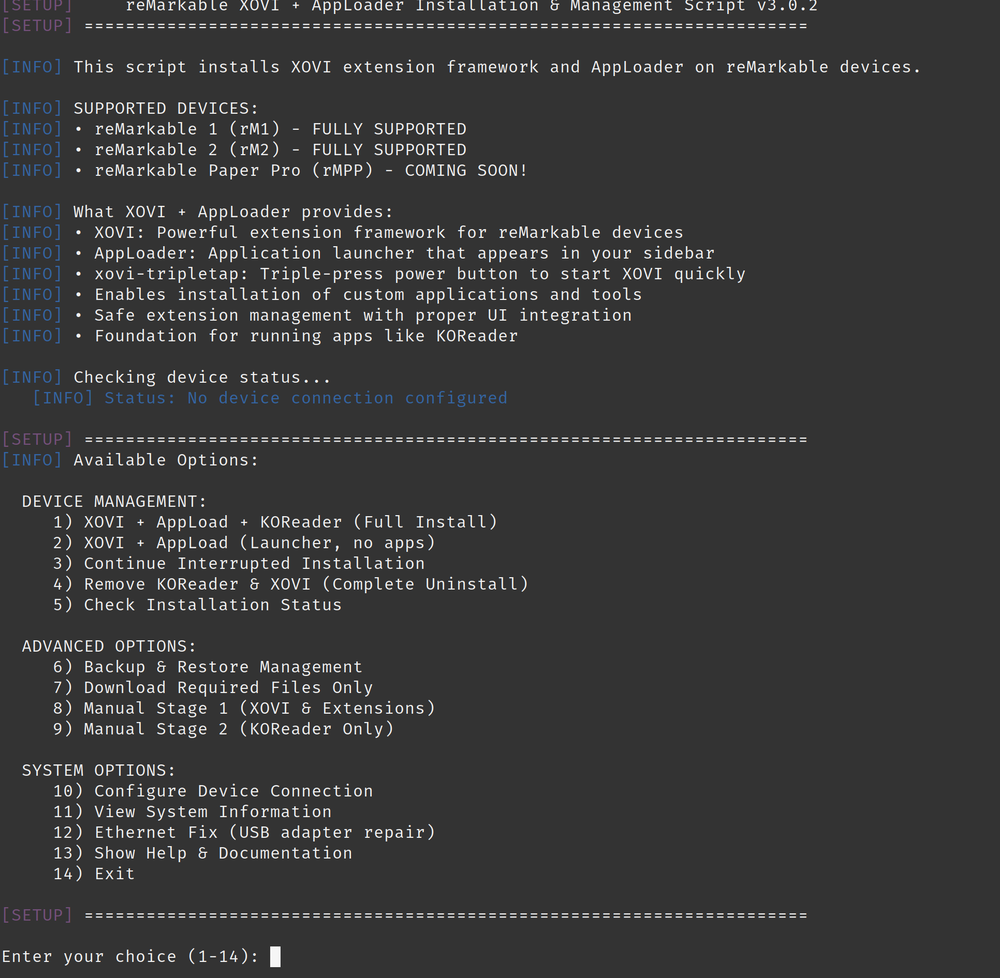

# reMarkable XOVI + AppLoader Installer

**Version 3.1.0** - The complete automated installation toolkit for XOVI extension framework and AppLoader on reMarkable devices.



## What's New in v3.1.0 - CRITICAL STABILITY FIX

- **CRITICAL BUG FIX**: Completely replaced broken `install-xovi-for-rm` with manual XOVI setup
- **100% Offline Installation**: No on-device downloads required - works on isolated devices
- **DNS-Independent**: Eliminates DNS resolution failures that caused installation failures
- **Bulletproof Setup**: Manual XOVI directory structure creation with all required scripts
- **Enhanced Progress**: Real-time hashtable rebuild progress output
- **USB Ethernet Safe**: Proper handling of USB gadget drivers during installation

## What's New in v3.0.4

- **WiFi Setup Guidance**: Comprehensive WiFi backup connection setup before installation
- **Installation Safety**: Smart WiFi backup + USB ethernet stability for bulletproof installs
- **User Education**: Clear step-by-step guidance for optimal installation experience
- **Improved User Flow**: WiFi setup instructions integrated into all installation options

## What's New in v3.0.3

- **USB Ethernet Fix**: Automatic repair service for missing USB ethernet adapters
- **Enhanced Connection Handling**: Improved retry logic with forced credential re-entry
- **Streamlined Installation**: Removed WiFi blocking functionality for better user experience
- **Menu Improvements**: Added ethernet fix option and better status checking
- **Stability Improvements**: Non-blocking status checks prevent menu hanging

## What's New in v3.0.1-3.0.2

- **Full reMarkable 1 Support**: Now supports both rM1 and rM2 devices
- **Smart Stage Detection**: Automatically detects interrupted installations and offers seamless continuation
- **Uninstall Without Backup**: Added safe removal option when backups aren't available
- **Enhanced Error Handling**: Improved menu stability and crash prevention
- **Automatic Timing**: Built-in 30-second wait after Stage 1 for optimal device reboot
- **Future Ready**: rMPP (reMarkable Paper Pro) support coming soon

## Device Compatibility

| Device | Status | Architecture |
|--------|--------|--------------|
| reMarkable 1 | **Fully Supported** | armv6l |
| reMarkable 2 | **Fully Supported** | armv7l |
| reMarkable Paper Pro (rMPP) | **Coming Soon** | - |

## Features

### Core Installation
- **XOVI Extension Framework**: Complete installation with automatic dependency management
- **AppLoader**: Powerful application launcher for reMarkable devices
- **Staged Installation**: Smart two-stage process handles hashtable rebuilds seamlessly
- **Auto-Detection**: Automatically detects device type and architecture

### Safety & Backup
- **Automatic Backups**: Creates complete system backups before any modifications
- **Restore Functionality**: Easy one-click restore from any backup
- **Safe Uninstall**: Clean removal with or without existing backups
- **Progress Tracking**: Smart stage detection prevents duplicate operations

### User Experience
- **Interactive Menus**: Intuitive command-line interface
- **WiFi Setup Guidance**: Step-by-step WiFi backup configuration before installation
- **Installation Safety**: Smart dual-connection setup (WiFi backup + USB primary)
- **Real-time Progress**: Live status updates throughout installation
- **Error Recovery**: Robust error handling and recovery options
- **Command-line Options**: Full automation support for advanced users

## Quick Start

### Prerequisites
- reMarkable device (rM1 or rM2) with SSH enabled
- Linux, macOS, or WSL environment
- `bash`, `ssh`, `scp` installed
- `expect` (optional, for fully automatic hashtable rebuild)

### Installation

1. **Download the installer**:
   ```bash
   git clone https://github.com/wowitsjack/remarkable-xovi-installer.git
   cd remarkable-xovi-installer
   chmod +x remarkable-xovi-installer.sh
   ```

2. **Run the installer**:
   ```bash
   ./remarkable-xovi-installer.sh
   ```

3. **Follow the interactive prompts** or use command-line options for automation

### Quick Install (One Command)
```bash
./remarkable-xovi-installer.sh -i YOUR_REMARKABLE_IP --force
```

## Command Line Options

| Option | Description |
|--------|-------------|
| `-h, --help` | Show help information |
| `-i, --ip IP` | Set reMarkable IP address |
| `-p, --password PASS` | Set SSH password (not recommended) |
| `--backup-menu` | Launch backup/restore menu directly |
| `--backup-only` | Create backup and exit |
| `--restore BACKUP` | Restore specific backup |
| `--force` | Skip confirmation prompts |
| `--stage1` | Run only Stage 1 installation |
| `--stage2` | Run only Stage 2 installation |
| `--continue` | Continue interrupted installation |

## Installation Process

### Pre-Installation: WiFi Setup
- **WiFi Backup Configuration**: Connect to home WiFi as emergency backup
- **Connection Confirmation**: Verify WiFi connectivity works properly
- **WiFi Disable**: Disable WiFi for stable USB ethernet installation
- **Safety Explanation**: Clear guidance on why this setup ensures stability

### Stage 1: Core Components
- System validation and device detection
- Automatic backup creation
- XOVI framework installation
- AppLoader deployment
- Hashtable rebuild (requires device restart)

### Stage 2: Finalization
- Post-reboot validation
- Extension activation
- Final system checks
- Installation completion

## Backup & Restore

The installer automatically creates backups before any system modifications:

- **Location**: `/opt/backup/` on reMarkable device
- **Contents**: Complete systemd units, binaries, and configurations
- **Restore**: One-click restoration through backup menu
- **Safety**: Multiple backup retention for maximum safety

### Backup Menu Options
1. **Create New Backup** - Generate fresh system backup
2. **Restore from Backup** - Select and restore any previous backup
3. **List All Backups** - View all available backups with timestamps
4. **Delete Old Backups** - Clean up storage space
5. **Uninstall without Backup** - Complete removal (use with caution)

## Important Notes

- **Offline Operation**: v3.1.0+ works completely offline - no internet required on device
- **WiFi Setup**: Follow pre-installation WiFi setup for backup connectivity
- **Dual Connection**: WiFi provides backup access, USB ethernet provides installation stability
- **Device Restart Required**: Stage 1 requires a device restart for hashtable rebuild
- **SSH Access**: Ensure SSH is enabled on your reMarkable device
- **Backup Safety**: Always maintain backups before system modifications
- **Network Reliability**: Manual XOVI setup eliminates network-dependent installation failures

## Troubleshooting

### Common Issues

**Connection Problems**:
```bash
# Check SSH connectivity
ssh root@YOUR_REMARKABLE_IP

# Verify device is responsive
ping YOUR_REMARKABLE_IP

# If USB ethernet not working, use WiFi temporarily
ssh root@YOUR_WIFI_IP
```

**WiFi Setup Issues**:
- Follow the pre-installation WiFi guidance carefully
- Ensure WiFi connection is confirmed before disabling
- Keep WiFi credentials handy in case USB fails during installation

**Permission Issues**:
```bash
# Ensure script is executable
chmod +x remarkable-xovi-installer.sh
```

**Installation Stuck**:
- Use `--continue` option to resume interrupted installations
- Check backup menu for restoration options
- Verify device has sufficient storage space

### Getting Help

1. Check the troubleshooting steps above
2. Review the installation logs
3. Try the backup/restore functionality
4. Open an issue on GitHub with full error details

## Contributing

We welcome contributions! Please:

1. Fork the repository
2. Create a feature branch
3. Test thoroughly on both rM1 and rM2
4. Submit a pull request with detailed description

## License

This project is licensed under the MIT License - see the [LICENSE](LICENSE) file for details.

## Acknowledgments

- XOVI extension framework developers
- AppLoader project contributors  
- reMarkable community for testing and feedback
- Everyone who helped make rM1 support possible

---
